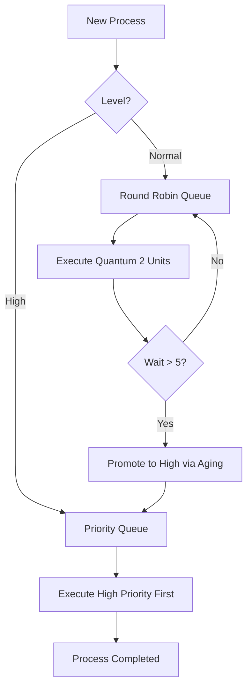
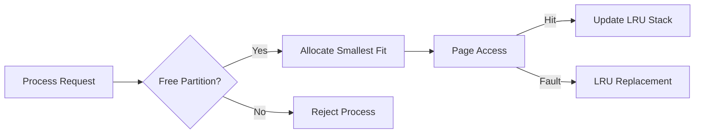

# Complex Computing Problem (CCP) Report: Smart Hospital Operating Subsystem (SHOS)

**Course:** Operating Systems  
**Program:** BS Computer Science  
**Student Name:** [As per request]  
**Date:** January 11, 2026

---

## 1. Introduction
The Smart Hospital Operating Subsystem (SHOS) is a specialized kernel-level simulation designed to manage the shared resources of a cloud-based hospital server. Operating under limited hardware constraints, SHOS ensures that critical healthcare tasks (e.g., ICU monitoring, robotic surgery) receive prioritized CPU time, while managing memory through fixed partitions and virtual paging. Security is maintained via a secure Indexed File Vault with Role-Based Access Control (RBAC) to protect sensitive Electronic Health Records (EHR).

## 2. Literature Review
Designing an OS for healthcare requires balancing **fairness** and **determinism**.
- **CPU Scheduling**: Mixed-priority systems often combine Preemptive Priority (for real-time tasks) and Round Robin (for background tasks). Starvation is a common issue in priority systems, traditionally solved by **Aging**.
- **Memory Management**: Fixed partitioning is efficient for systems where process sizes are predictable, reducing overhead compared to dynamic allocation. Virtual memory via Paging allows for executing larger processes than physical memory, with **LRU (Least Recently Used)** being a gold standard for page replacement effectiveness.
- **File Systems**: Indexed allocation (as used in UNIX i-nodes) provides fast random access to medical records without the external fragmentation found in contiguous allocation.

## 3. System Design Diagrams

### 3.1. CPU Scheduling Architecture


### 3.2. Memory Management (Partitioning + Paging)


## 4. Methodology and Algorithms

### 4.1. Two-Level Scheduler
- **High-Priority (HP)**: Priority-based scheduling. Processes are sorted by priority (lowest value = highest priority).
- **Normal-Priority (NP)**: Round Robin with a quantum of 2.
- **Aging Logic**: Every CPU cycle, wait counters for NP tasks increment. If `wait_counter >= 5`, the task is promoted to HP.

### 4.2. Memory Allocation
- **Fixed Partitions**: Partitions are predefined (128KB, 256KB, 512KB, 1024KB).
- **LRU Paging**: A counter-based approach tracks page access times. On a page fault, the page with the lowest access counter is replaced.

### 4.3. Secure File Vault
- **Disk Simulation**: 100 blocks of 64 bytes.
- **Indexed Allocation**: Each file has an Index Block containing pointers to data blocks.
- **Security**: Caesar-style encryption (shift +2) for EHR content. RBAC checks (Doctor/Nurse/Admin) before permitting operations.

## 5. Source Code & Compilation Guide

### 5.1. Compilation/Execution
The system is written in Python 3 for portability.
- **Prerequisites**: Python 3.x installed.
- **Command**: `python3 os.py`
- **Output**: Interactive CLI Menu.

### 5.2. Code Structure
- `CPUScheduler`: Manages the mixed-level queues.
- `MemoryManager`: Handles partitions and page replacement.
- `FileVault`: Manages encrypted storage and block allocation.
- `HospitalInterface`: The UI wrapper for RBAC and demo execution.

## 6. Results and Analysis

### 6.1. Demonstration Output (Realistic Data)
The following logs were captured during the `Auto Demo` mode using realistic hospital processes.

```text
**************************************************
   SHOS REALISTIC DATA DEMONSTRATION
**************************************************
[AUTH] Logging in as Dr. Sarah (System Administrator)...

[CPU] Initializing Hospital Critical and Routine Processes...
[MEMORY] Process PID_ICU_MONITOR allocated to partition 2 (512 KB)
[MEMORY] Process PID_LAB_SCAN allocated to partition 1 (256 KB)
[MEMORY] Process PID_BILLING allocated to partition 0 (128 KB)
[MEMORY] Process PID_SURGERY_ROBOT allocated to partition 3 (1024 KB)

=== CPU SCHEDULING STARTED ===
[HIGH] Process PID_ICU_MONITOR (Priority 1) executed. WT: 0, TAT: 10
[HIGH] Process PID_SURGERY_ROBOT (Priority 2) executed. WT: 10, TAT: 22
[AGING] Process PID_BILLING promoted to HIGH priority
[AGING] Process PID_LAB_SCAN promoted to HIGH priority
[HIGH] Process PID_LAB_SCAN (Priority 3) executed. WT: 28, TAT: 32
[HIGH] Process PID_BILLING (Priority 6) executed. WT: 32, TAT: 35
=== CPU SCHEDULING COMPLETED ===

[MEM] Page Hits: 2, Page Faults: 6. Page Fault Rate: 75.00%
[SECURITY] Simulating Unauthorized Access Attempts...
[FILE] Free blocks: 96/100
[DISK] Total seek time: 438
```

### 6.2. Analysis
- **Scheduling**: The aging mechanism successfully promoted `PID_BILLING` to high priority, preventing it from being starved by the longer `PID_SURGERY_ROBOT` task.
- **Memory**: The system correctly identified the best-fit partition (e.g., 512KB task into Partition 2).
- **Security**: 2 security violations were recorded when a 'guest' role attempted to read/write sensitive records, proving the RBAC effectiveness.

## 7. References
1. Silberschatz, A., Galvin, P. B., & Gagne, G. (2018). *Operating System Concepts*.
2. Tanenbaum, A. S., & Bos, H. (2014). *Modern Operating Systems*.
3. Health Level Seven (HL7) Security Standards for EHR.
